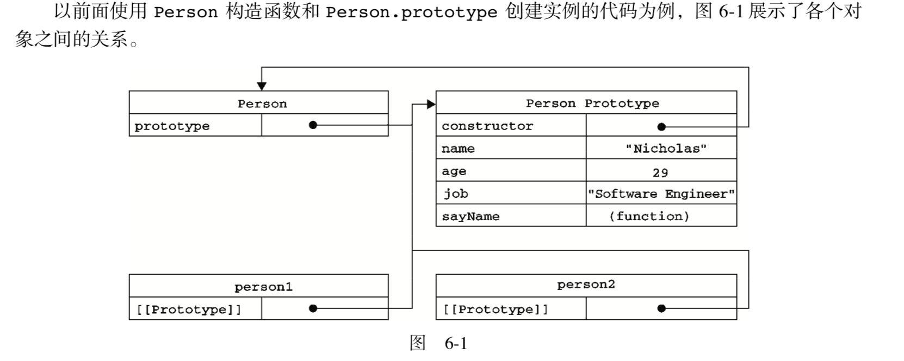
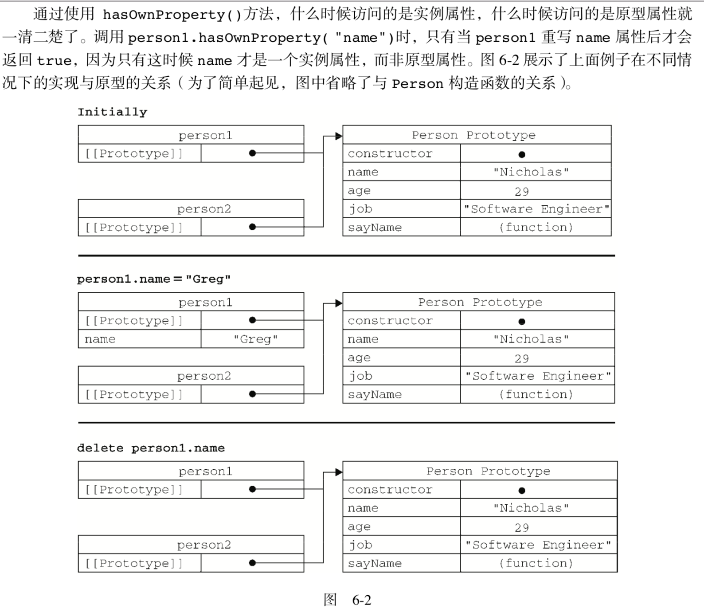
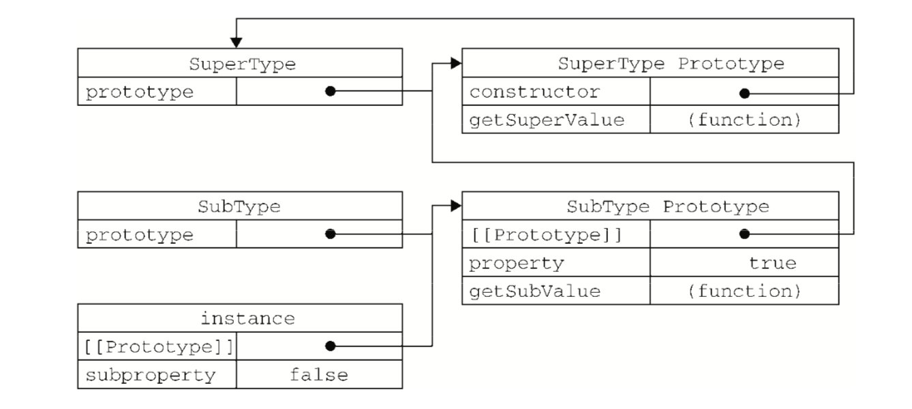

## 创建对象的方式

1. 工厂模式
```javascript
    function createPerson(name, age, job) {
        var o = new Object();
        o.name = name;
        o.age = age;
        o.job = job;
        return o;
    }
    const persion1 = createPerson('niuniu', 18, 'developer')
    const persion2 = createPerson('huahua', 16, 'dreamer')
```
> 工厂模式虽然解决了创建多个相似对象的问题，但去没有解决对象识别的问题（既怎样知道一个对象的类型）

2. 构造函数模式
```javascript
    function Person(name, age, job) {
        this.name = name;
        this.age = age;
        this.job = job;
        this.sayName = function() {
            console.log(this.name;)
        };
    }
    const persion1 = new Person('niuniu', 18, 'developer')
    const persion2 = new Person('huahua', 16, 'dreamer')
```
构造函数执行4个步骤：   
（1）创建一个新对象；  
（2）将构造函数的作用域赋给新对象（因此，this 就指向了这个新对象）；   
（3）执行构造函数中的代码（为这个新对象添加属性）；   
（4）返回新对象

person1 和 person2 分别保存着Person的一个不同的实例。这两个对象都有一个constructor属性，该属性指向Person
```javascript
    person1.constructor === Person // true
    person2.constructor === Person // true
```
> 通过 instanceof 可以知道，创建的实例既是 Object 的实例，也是 Person 的实例；   
创建自定义个构造函数意味着将来可以将它的实例标识为一种特定的类型；***而这正是构造函数胜过工厂模式的地方***   

> 缺点：   
每个方法都要在每个实例上重新创建一遍，例如 sayName()
```javascript
    person1.sayName === person2.sayName // false
```
> 可以把 sayName 定义到构造函数外面；
```javascript
    function Person(name, age, job) {
        this.name = name;
        this.age = age;
        this.job = job;
        this.satName = sayName;
    }
    function sayName() {
        console.log(this.name)
    }
```
> 缺点：  
如果对象需要定义很多方法，就会定义很多全局对象；   
而全局作用域中定义的函数实际上只能被某个对象调用，这让全局作用域有点名不副实。

3. 原型模式

> 我们创建的每个函数都有一个prototype属性，这个对象的用途是包含可以由特定类型的所有实例共享的属性和方法；   
使用原型对象的好处是可以让所有对象实例共享它所包含的属性和方法
```javascript
    function Person() {}
    Person.prototype.name = 'niuniu';
    Person.prototype.age = 18;
    Person.prototype.job = 'developer';
    Person.prototype.sayName = function() {
        console.log(this.name);
    }
    var person1 = new Person();
    person1.sayName(); // 'niuniu'
    var person2 = new Person();
    person2.sayName(); // 'niuniu'
    person1.sayName === person2.sayName // true
```
> 无论什么时候，只要创建了一个新函数，就会根据一组特定的规则为该函数常见一个 prototype 属性，这个属性指向函数的原型对象。在默认情况下，所有原型对象都会自动获得一个 constructor 属性，这个属性包含一个指向 prototype 属性所在函数的指针。通过这个构造函数，我们还可以为原型对象添加其他属性和方法。   <hr>
创建了自定义的构造函数之后，其原型对象只会取得 constructor 属性；至于其他方法，则都是从Object继承而来的。  <hr>
当调用构造函数创建一个新实例后，该实例的内部将包含一个指针，指向构造函数的原型对象；  
***这个连接存在于实例与构造函数的原型对象之间，而不是实例与构造函数之间***



> isPrototypeOf() 方法来确定对象之间是否存在这种关系
```javascript
    Person.prototype.isPrototypeOf(person1) // true
    Person.prototype.isPrototypeOf(person2) // true
```
> getPrototypeOf() 返回 __proto__ 的值

```javascript
    Object.getPrototypeOf(person1) === Person.prototype // true
```


4. 组合使用构造函数模式和原型模式
> 结合构造函数和原型模式的有点  
构造函数可以传值   
原型可以定义公共方法
```javascript
    function Person(name, age, job) {
        this.name = name;
        this.age = age;
        this.job = job;
    }
    Person.prototype.sayName = function() {
        console.log(this.name)
    }
```
5. 动态原型模式
6. 寄生构造函数模式
7. 稳妥构造函数模式

## 继承
> oo语言有两种继承方式：接口继承(只继承方法签名)、实现继承(继承实际的方法)

1. 原型链：利用原型让一个引用类型继承另一个引用类型的属性和方法
```javascript
function SuperType () {
    this.property = true;
}
SuperType.prototype.getSuperValue = function () {
    return this.property;
}
function SubType() {
    this.subProperty = false;
}
SubType.prototype = new SuperType()
SubType.prototype.getSubValue = function () {
    return this.subProperty;
}
var instance = new SubType()
```

